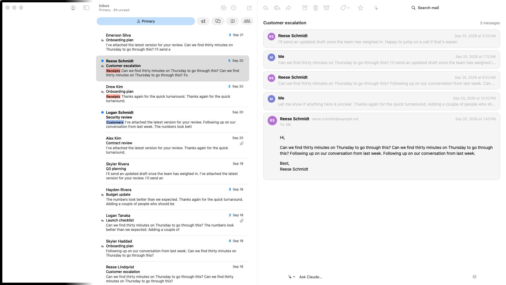
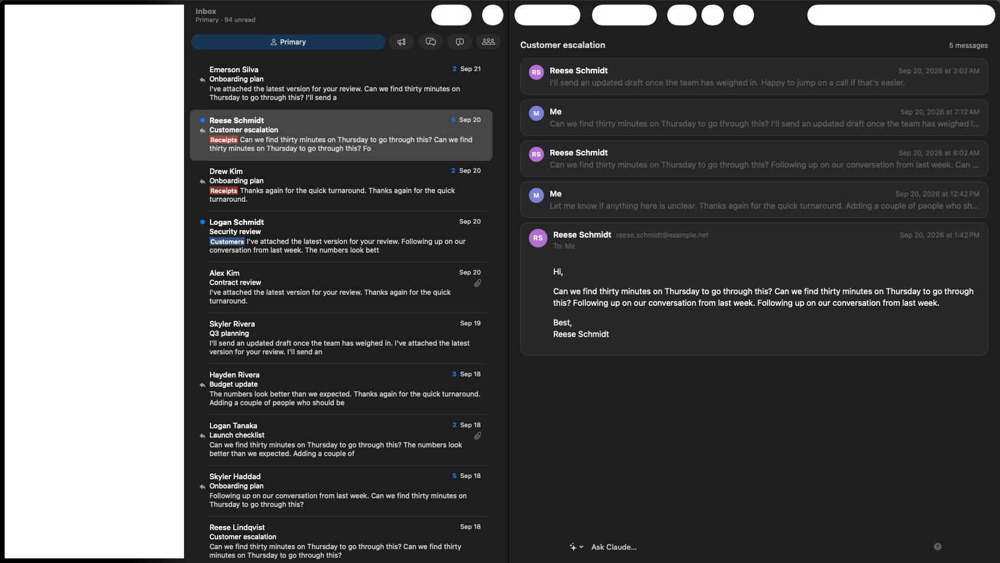
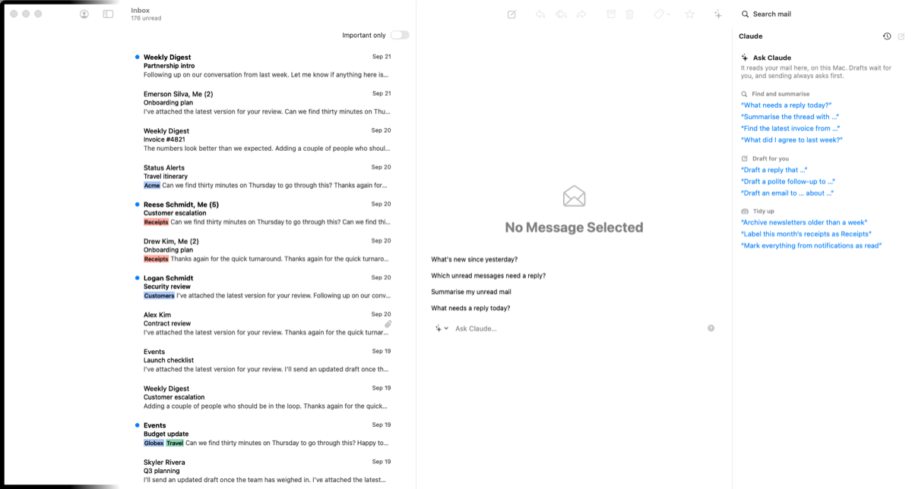
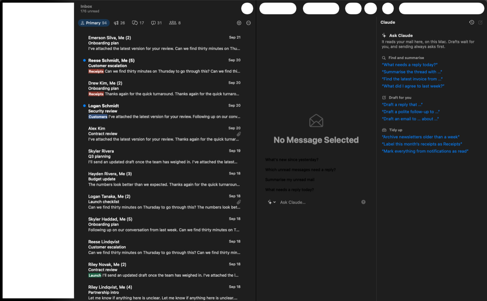
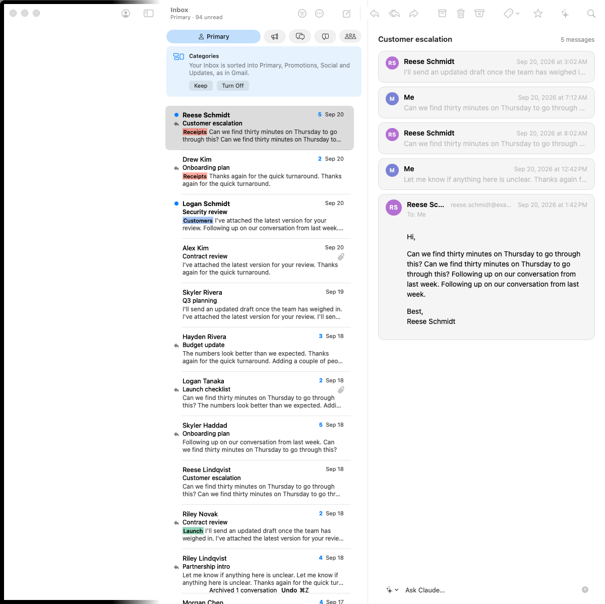

# OpenAGC design system

A small design system for the macOS app. It exists so that the app looks
like one piece, sits naturally next to Mail on macOS 26, and does not
repeat mistakes such as the rule under the list header that ran into the
floating sidebar (oagc-0cw).

The code lives in `macos/OpenAGC/Design/`:

| File | Holds |
| --- | --- |
| `Tokens.swift` | `Space`, `Radius`, `TypeRole`, `Tone` |
| `Surfaces.swift` | `glassCapsule()`, `card(_:)`, `bandBackground(_:)`, `columnHeader { }` |
| `Components.swift` | `ListHeaderBar`, `InsetRule`, `PaneDivider`, `Banner`, `LabelChip` |

`scripts/design-lint.sh` checks the rules below that a grep can check.
`scripts/test-macos.sh` runs it in strict mode, so a literal padding or a
raw `Divider()` fails the app's checks.

## Principles

1. **The system first.** Use the platform's own surfaces: the split view,
   toolbar, glass, scroll-edge effects, `ContentUnavailableView`, and
   system colours. Draw something custom only when the platform has
   nothing for it.
2. **Content goes edge to edge; chrome floats.** On macOS 26 the sidebar
   and toolbar float over content as glass. Columns extend beneath them.
   So nothing a column draws may assume where its visible edge is.
3. **Separation by space before lines.** Group with spacing and type
   weight. A rule is the last resort, and never a full-width one.
4. **One way to do each thing.** Each kind of notice has one surface and
   each kind of separator has one component.

## Tokens

### Spacing (`Space`)

| Token | pt | Use |
| --- | --- | --- |
| `hair` | 2 | inside chips; between a title and its subtitle |
| `xs` | 4 | icon to text; rows of a tight list |
| `s` | 6 | vertical padding of compact bars and banners |
| `m` | 8 | default gap between controls; vertical padding of capsules |
| `l` | 12 | horizontal padding of bars and banners in a column |
| `xl` | 16 | horizontal padding of glass capsules; panel padding |
| `xxl` | 20 | the reader's margins (as in Mail); gaps between sections |
| `xxxl` | 24 | sheet padding |
| `page` | 32 | full-window pages (onboarding) |

Nothing in between. When a layout seems to need 10, it gets 8 or 12. Zero
is always allowed. A measurement that aligns one thing with another (the
routine activity line under its name, past the icon) is a named constant
in its view, not a spacing token.

### Radii (`Radius`)

`chip` 4 (label chips), `control` 6 (attachment tiles, small filled
controls), `card` 8 (cards), `panel` 12 (floating panels). Capsules use
`.capsule`, never a large radius.

### Type (`TypeRole`)

| Role | SwiftUI | Where |
| --- | --- | --- |
| `title` | title3 semibold | the reader's subject; sheet titles |
| `heading` | headline | panel headings (the agent column's name) |
| `groupLabel` | subheadline semibold | groups inside a panel |
| `meta` | callout | bars, banners, notices, chips in SwiftUI |
| `caption` | caption | fine print |

The AppKit thread row uses `TypeRole.rowSender(unread:)` (13 pt, semibold
when unread), `rowSubject(unread:)` (12 pt, medium when unread),
`rowSecondary` (12 pt) and `chip` (11 pt medium).

The thread row is calm, as in Mail: sender and date, the subject, two
lines of preview, and a hairline (`separatorColor`) inset to the text
column between rows, hidden under the selection. The thread's message
count sits beside the date in the accent colour, not as "(3)" after the
names; a replied arrow sits under the unread dot when you answered; the
Important marker is left out where every row is Important.

### Colour (`Tone`)

Always system colours underneath, so light and dark, Increase Contrast and
the user's accent colour follow without extra work.

| Token | Is | Use |
| --- | --- | --- |
| `unread` / `unreadNS` | accent colour | the unread dot, as in Mail |
| `important` / `importantNS` | system yellow | Gmail's Important marker |
| `chipFill(hex:)` | label colour at 28 % | label chips; labels without a colour use tertiary label |
| `highlight` | tint at 25 % | the keyboard-highlighted item inside glass |
| `controlFill` | quaternary at 60 % | small filled controls (attachments) |
| `Intent.attention` | yellow at 14 %, outlined in cards | needs the user: sign in again, approve a send |
| `Intent.info` | tint at 10 % | worth knowing: created by an agent, your own prompt |
| `Intent.caution` | orange at 10 % | a consequence: a draft could not be saved |
| `Intent.neutral` | quaternary at 45 % | resting cards, the remote-images notice |

Red is only for failure (a failed tool call, an attachment error). Green
is only for "approved".

## Surfaces

| Surface | API | Rules |
| --- | --- | --- |
| Glass capsule | `.glassCapsule()` | Floats over content with a margin; never pinned to a column edge; no dividers inside. The undo notice, the agent prompt. |
| Column header | `.columnHeader { … }` | A `safeAreaBar` at the top of a column with the hard scroll-edge effect. The content scrolls under it; the system draws the edge. It never draws its own rule. |
| Card | `.card(intent)` | On the background, in content. The only content with outlines (attention cards only). |
| Band | `Banner` (uses `.bandBackground`) | Full column width inside the column's safe area, tinted by intent, no rule above or below. |

## Components

- **`ListHeaderBar`**: the controls at the top of a column (the Inbox's
  Important-only switch, category tabs). Always inside `.columnHeader`.
- **`InsetRule`**: a separator between items inside a panel, inset on
  both sides. The only rule content may draw.
- **`PaneDivider`**: a vertical rule between two panes that share a
  column (the reader and the agent column), or between a sheet's content
  and its button bar.
- **`Banner`**: icon, one line and optional small buttons, by intent.
  `inset:` lines it up with the content it sits over (the reader uses
  `Space.xxl`).
- **`LabelChip`**: a label's name on its faint colour.
- **Empty states**: `ContentUnavailableView`, with a title, an SF Symbol
  and at most one sentence.
- **Menus** keep `Divider()` as their separator; mark the line `// menu`.
- **Hover descriptions:** every button, menu button, toggle and picker
  has a `.hoverHelp(...)` saying what it does, in a short sentence without a
  full stop, with its shortcut in parentheses when it has one ("Archive
  (E)"). Menu items, context-menu items and confirmation-dialog buttons
  show no tooltips on macOS and are exempt (mark `// no-help: <why>`
  where the check cannot tell). `scripts/help-lint.py --strict` runs in
  `test-macos.sh`. Why not plain `.help`: on macOS 26 SwiftUI's tool tips
  do not appear in column-header bars or on buttons in Settings forms
  (checked by hovering, 2026-09-28), and never reach the window toolbar.
  `.hoverHelp` adds an AppKit tool tip over the control that lets clicks
  through; toolbar buttons keep `.help` and `ToolbarHelp`, which
  `ToolbarToolTips` copies onto the toolbar items.

### Toolbar

The toolbar is laid out like Mail's: New Message in the list column's
toolbar (`ListToolbar`), at its trailing edge; then, from the reader's
leading edge, glass groups separated by `ToolbarSpacer(.fixed)`, from
most to least often used: reply, reply all and forward; archive, trash
and junk; label and star; then the agent's toggle; search at the
trailing edge. Each button has a help tag naming its shortcut, is
disabled rather than hidden when it has no target, and does exactly what
the matching Message menu item does.

## Rules

1. **No full-width rules across a column's edge.** Columns extend
   beneath the floating sidebar, so a rule drawn "across the column" shows
   through the sidebar's glass. Use `.columnHeader` or `InsetRule`.
2. **Nothing drawn under the floating sidebar.** Backgrounds and bands
   stay inside the column's safe area. Do not `ignoresSafeArea` a fill in
   the content column.
3. **No dividers inside glass.** Group inside a capsule with spacing.
4. **Headers are safe-area bars.** Any bar at the top of a scrolling
   column is a `.columnHeader`, so the scroll edge belongs to the system.
5. **Tokens only.** No literal padding, stack spacing or corner radius
   outside `Design/`; the lint checks it.
6. **Every state in light and dark.** A change to a surface comes with
   snapshots in both appearances (`scripts/snapshot.sh out.png
   -OpenAGCSnapshotAppearance dark`).

## Snapshots

Self-snapshots cannot capture glass (the sidebar, the toolbar's glass
groups and capsules come out blank or white), so these show layout and
colour, not materials. Refresh them with `scripts/snapshot.sh`.

| Light | Dark |
| --- | --- |
|  |  |
|  |  |
|  | |
